- [About](#org269ef66)
- [Images](#org75559e5)
- [Schematic](#orgf491974)
- [PCB](#org81ad6ba)
- [Bill of Materials](#org57821d6)
- [Development](#orgd241264)

    <!-- This file is generated automatically from metadata -->
    <!-- File edits may be overwritten! -->


<a id="org269ef66"></a>

# About

```markdown
- Project Name: wingbeat_detector
- Description: Measures fly wingbeats using IR light reflected from flapping fly wings.
- Version: 3.0
- Kicad Version: 7.0.1
- Release Date: 2023-03-29
- Creation Date: 2023-02-17
- License: GPL-3.0
- URL: https://github.com/peterpolidoro/wingbeat_detector
- Author: Peter Polidoro
- Email: peter@polidoro.io
- Copyright: 2023 Peter Polidoro
- References:
  - https://www.kicad.org/
  - https://github.com/janelia-kicad/light_sensor_boards
```


<a id="org75559e5"></a>

# Images


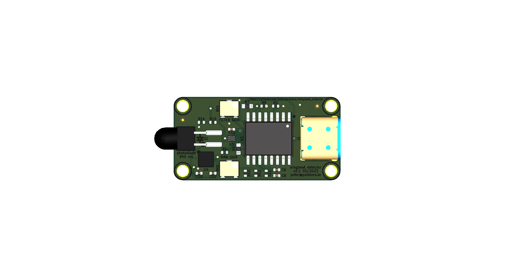

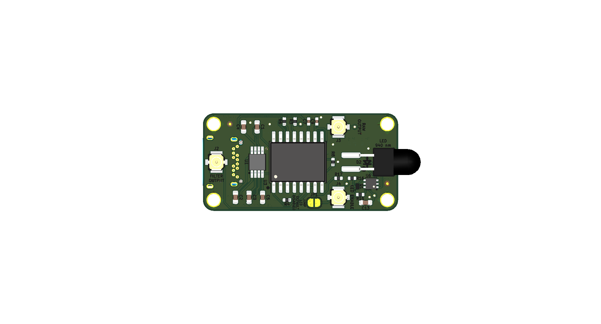

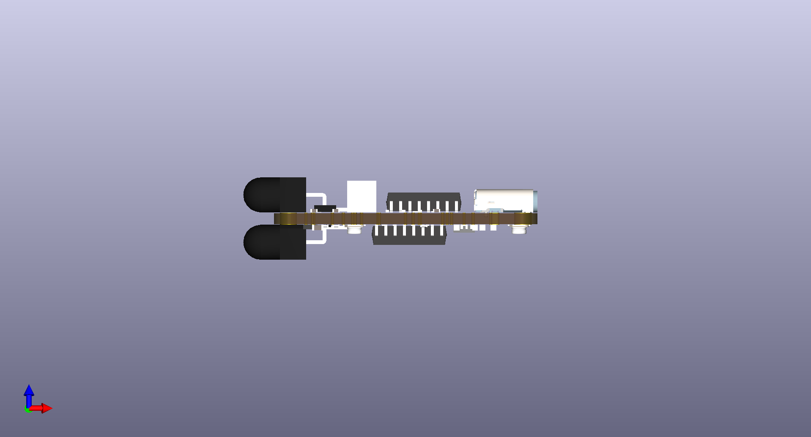

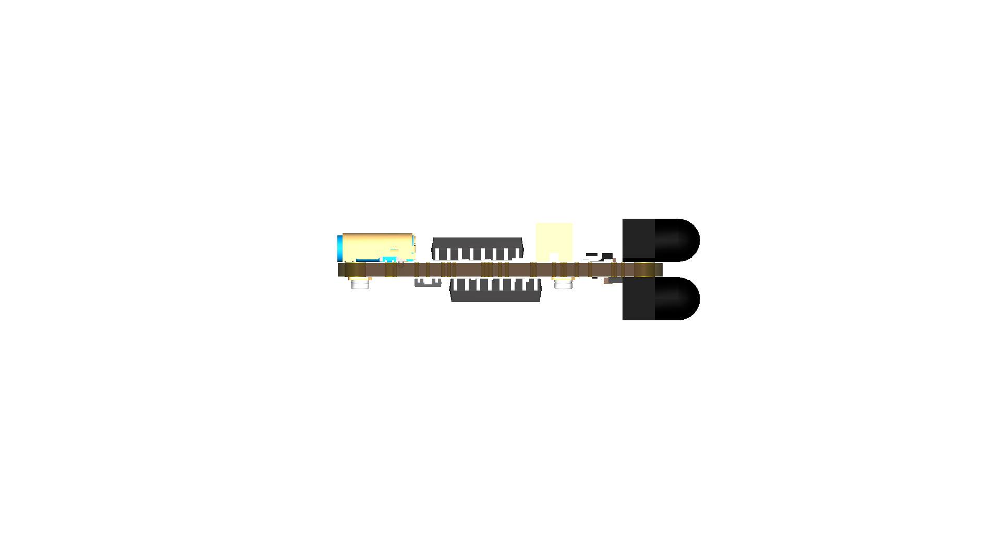

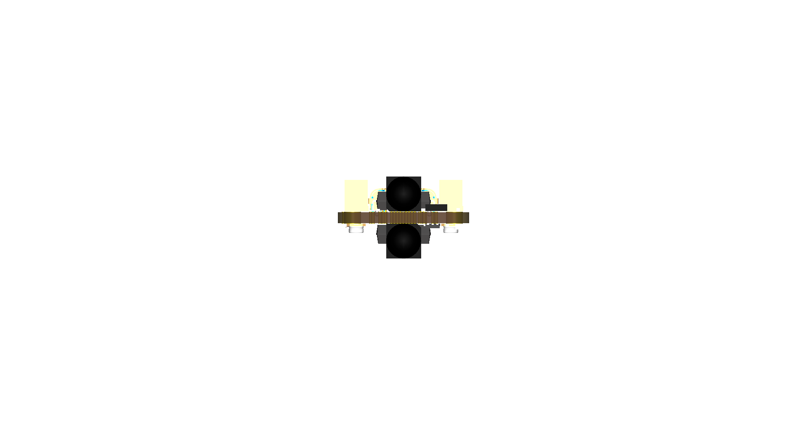

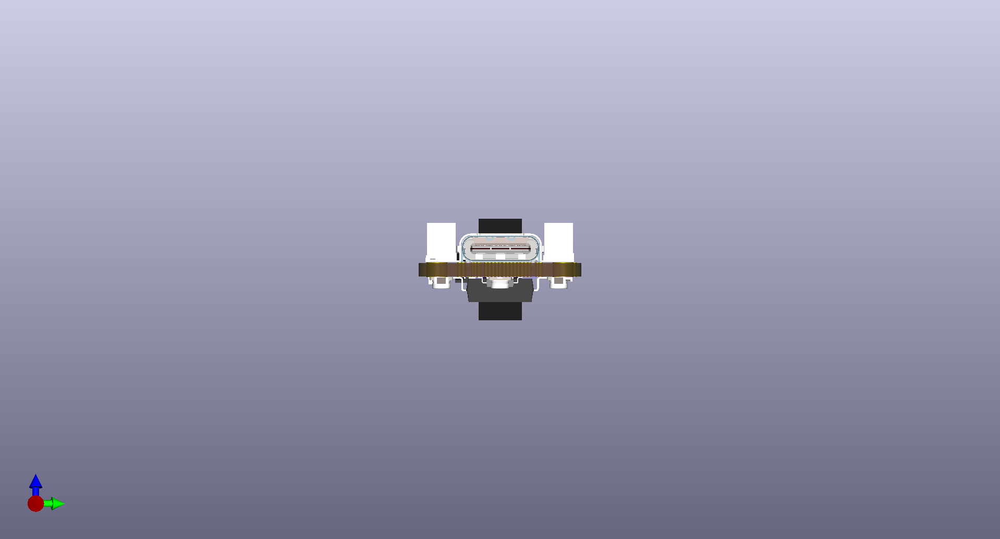


<a id="orgf491974"></a>

# Schematic

[./documentation/schematic/wingbeat\_detector.pdf](./documentation/schematic/wingbeat_detector.pdf)


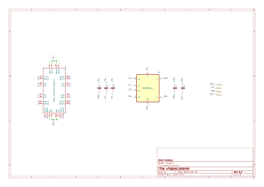

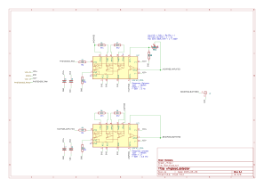

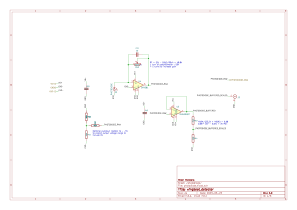

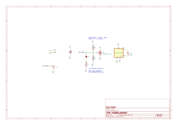

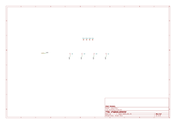


<a id="org81ad6ba"></a>

# PCB


<a id="org57821d6"></a>

# Bill of Materials


## Board

| Item | Reference(s)                    | Quantity | Manufacturer                                | Manufacturer Part Number | Vendor   | Vendor Part Number    | Description                      | Package          |
|---- |------------------------------- |-------- |------------------------------------------- |------------------------ |-------- |--------------------- |-------------------------------- |---------------- |
| 1    | C1 C2 C3 C4 C5 C13              | 6        | TDK Corporation                             | C1608X5R1C475K080AC      | Digi-Key | 445-7478-1-ND         | CAP CER 4.7UF 16V X5R 0603       |                  |
| 2    | C6 C7 C8 C9 C10 C12             | 6        | Yageo                                       | CC0402ZRY5V8BB104        | Digi-Key | 311-1375-1-ND         | CAP CER 0.1UF 25V Y5V            | 0402             |
| 3    | C11                             | 1        | TDK Corporation                             | CGA2B2C0G1H020C050BA     | Digi-Key | 445-5572-1-ND         | CAP CER 2PF 50V C0G              | 0402             |
| 4    | D1                              | 1        | American Bright Optoelectronics Corporation | BPD-BQDA38V-FZ04         | Digi-Key | BPD-BQDA38V-FZ04CT-ND | SENSOR PHOTODIODE RADIAL         |                  |
| 5    | D2                              | 1        | American Bright Optoelectronics Corporation | BIR-BM17J8V-FZ04         | Digi-Key | BIR-BM17J8V-FZ04CT-ND | 5MM 940 IR                       |                  |
| 6    | J1                              | 1        | Amphenol                                    | 10137062-00021LF         | Digi-Key | 609-6109-1-ND         | CONN RCP USB3.1 TYPEC 24P SMD RA |                  |
| 7    | J2 J3 J4                        | 3        | Amphenol RF                                 | A-1JB                    | Digi-Key | 115-A-1JBCT-ND        | CONN UMC JACK STR 50 OHM SMD     |                  |
| 8    | Q1                              | 1        | Texas Instruments                           | CSD17483F4               | Digi-Key | 296-38914-1-ND        | MOSFET N-CH 30V 1.5A 3PICOSTAR   |                  |
| 9    | R1 R3 R6 R8 R10 R11 R12 R14 R16 | 9        | Panasonic Electronic Components             | ERJ-2RKF4992X            | Digi-Key | P49.9KLCT-ND          | RES SMD 49.9K OHM 1% 1/10W       | 0402             |
| 10   | R2 R4                           | 2        | Panasonic Electronic Components             | ERJ-2RKF6812X            | Digi-Key | P68.1KLCT-ND          | RES SMD 68.1K OHM 1% 1/10W       | 0402             |
| 11   | R5 R7                           | 2        | Vishay Dale                                 | CRCW06033M65FKEA         | Digi-Key | 541-3.65MHCT-ND       | RES SMD 3.65M OHM 1% 1/10W       | 0603             |
| 12   | R9                              | 1        | Panasonic Electronic Components             | ERJ-2RKF2490X            | Digi-Key | P249LCT-ND            | RES SMD 249 OHM 1% 1/10W         | 0402             |
| 13   | R13 R15                         | 2        | Panasonic Electronic Components             | ERJ-2RKF2322X            | Digi-Key | P23.2KLCT-ND          | RES SMD 23.2K OHM 1% 1/10W       | 0402             |
| 14   | R17                             | 1        | Panasonic Electronic Components             | ERJ-2RKF2001X            | Digi-Key | P2.00KLCT-ND          | RES SMD 2K OHM 1% 1/10W          | 0402             |
| 15   | RV1 RV2                         | 2        | Bourns Inc.                                 | 3223W-1-504E             | Digi-Key | 3223W-1-504ECT-ND     | TRIMMER 500K OHM 0.125W J LEAD   |                  |
| 16   | U1                              | 1        | Maxim Integrated                            | MAX865EUA+               | Digi-Key | MAX865EUA+-ND         | IC REG CHARGE PUMP INV DL 8UMAX  | SOP65P490X110-8N |
| 17   | U2 U3                           | 2        | Texas Instruments                           | UAF42AU                  | Digi-Key | UAF42AU-ND            | IC UNIV ACTIVE FILTER 16-SOIC    |                  |
| 18   | U4                              | 1        | Texas Instruments                           | OPA381AIDRBT             | Digi-Key | 296-17363-1-ND        | IC TRANSIMPEDANCE 1 CIRCUIT 8SON |                  |
| 19   | U5                              | 1        | STMicroelectronics                          | TSV630IQ1T               | Digi-Key | 497-17045-1-ND        | IC OPAMP GP 1 CIRCUIT            | 6DFN             |
| 20   | U6                              | 1        | American Bright Optoelectronics Corporation | AB-EZPC-10               | Digi-Key | AB-EZPC-10CT-ND       | IC LED DRIVER LINEAR 50MA        | 6DFN             |


## Supplemental

| Item | Quantity | Manufacturer       | Manufacturer Part Number        | Description                      |
|---- |-------- |------------------ |------------------------------- |-------------------------------- |
| 1    | 1        | Amphenol RF        | 095-850-210-150                 | BNC STRAIGHT BULKHEAD JACK TO AM |
| 2    | 1        | Raspberry Pi       | RPI USB-C POWER SUPPLY BLACK US | AC/DC WALL MNT ADAPTER 5.1V 15W  |
| 3    | 1        | Pomona Electronics | 5697-6                          | CBL ASSY BNC PLUG-PLUG RG58 6"   |
| 4    | 1        | Pomona Electronics | 5697-60                         | CBL ASSY BNC PLUG-PLUG RG58 5'   |
| 5    | 1        | Pomona Electronics | 5697-120                        | CBL ASSY BNC PLUG-PLUG RG58 10'  |
| 6    | 1        | Pomona Electronics | 5069                            | TEST LEAD BNC TO SOCKET 5.6"     |
| 7    | 1        | Pomona Electronics | 5305                            | TEST LEAD BNC TO GRAB HOOK 5.5"  |


<a id="orgd241264"></a>

# Development


## Install Guix

[Install Guix](https://guix.gnu.org/manual/en/html_node/Binary-Installation.html)


## Edit metadata.org

    make -f .metadata/Makefile metadata-edits


## Tangle metadata.org

    make -f .metadata/Makefile metadata


## Edit project

    make -f .metadata/Makefile project-edits
    exit